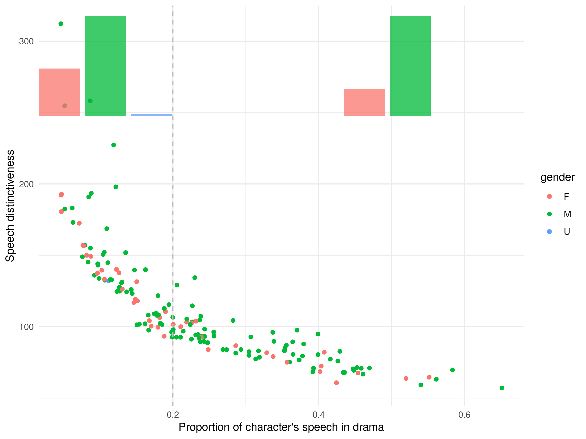

## Setup

```{r,include=F}
knitr::opts_chunk$set(echo = TRUE,message = F,error = F,warning = F,eval = T)
```

```{r,message=F,warning=F}
## main
library(tidyverse)
library(tidytext)
library(tidylo) # log odds library

## visualisations
library(ggsankey)
library(patchwork)
library(grid)

## functions for 'curves-under-keywords' method
source("src/loo_distinct.R")
```

## Data processing

```{r,warning=F,message=FALSE}
## read data
als <- read_tsv("https://git.unistra.fr/methal/alsatian-character-speech/-/raw/main/overall-per-character-speech-postpro.tsv")

## make sure characters have unique IDs
ids <- als %>% 
  reframe(speaker_id = paste(speaker,play_short_name)) %>% 
  distinct(speaker_id,.keep_all = T) %>% 
  mutate(char_id = paste0(str_extract(speaker_id,"^."),row_number()))

## cobmine IDs with the main table
als <-  als %>% 
  mutate(speaker_id = paste(speaker,play_short_name)) %>% 
  left_join(ids,by="speaker_id")
```

Here I collapse all utterances per character into bag of words (one character per row) and tokenize it; separate metadata table will serve for referencing later. [Better tokenizer](https://zenodo.org/records/2454993) exists for Alsatian, but I don't have time to implement it right now.

```{r}
als_speech <- als %>% group_by(char_id,play_short_name) %>% summarize(text=paste(text,collapse="\n\n"))

als_meta <- als %>% select(-text) %>% distinct(char_id,.keep_all = T)

als_tok <- als_speech %>%
  group_by(char_id,play_short_name) %>% 
  unnest_tokens(input=text,output="word",token="words")
```

I also infer author's gender based on the first name (which might be bad idea)

```{r}
author_g <- als_meta %>% 
  count(author,sort = T) %>% 
  select(-n) %>% 
  mutate(g_author = c("M", "M", "M", "M","M", "F","M","M","M","M","M", "M","M","M","F","M","M","F","M", "M","M","F","M","M"))

```


Counting: how much words each character says and what proportion does it make of the whole play. 

```{r}
counts <- als_tok %>%
  group_by(char_id,play_short_name) %>%
  count(char_id) %>%  # count rows/words
  group_by(play_short_name) %>%
  mutate(char_part = n/sum(n)) %>% # proportion to the whole
  select(-play_short_name)

t<-counts %>% 
  arrange(-n,-char_part) %>%
  head(10)
knitr::kable(t)
```
Combining information on characters & authors back to the metadata

```{r}
als_meta<-als_meta %>% left_join(author_g,by="author") %>%
  left_join(counts)
```

## Exploration: metadata

I wanted to do quick Sankey plots to see how characters relate to categories. First, all together.

```{r,fig.width=8,fig.height=6}
df <- als_meta %>%
  filter(!str_detect(gender, "gdr_err"),
#         job_category != "jact_err",
         !gender %in% c("U", "B")) %>% 
  make_long(social_class, gender,job_category,genre) 

ggplot(df, aes(x = x, 
               next_x = next_x, 
               node = node, 
               next_node = next_node,
               fill = factor(node),
               label = node)) +
  geom_sankey(flow.alpha = .6,node.color = "gray30") +
  geom_sankey_label(size = 3, color = "white", fill = "gray40") +
  scale_fill_viridis_d() +
  theme_sankey(base_size = 18) +
  labs(x = NULL) +
  theme(legend.position = "none",
        plot.title = element_text(hjust = .5)) +
  ggtitle("Character distribution: all")

```
Now, what if we look only at characters that speak at least 1000 words?

```{r,fig.width=8,fig.height=6}
df <- als_meta %>%
  filter(!str_detect(gender, "gdr_err"),
         !gender %in% c("U", "B"),
         n >= 1000) %>% 
  make_long(social_class, gender,job_category,genre) 

ggplot(df, aes(x = x, 
               next_x = next_x, 
               node = node, 
               next_node = next_node,
               fill = factor(node),
               label = node)) +
  geom_sankey(flow.alpha = .6,
              node.color = "gray30") +
  geom_sankey_label(size = 3, color = "white", fill = "gray40") +
  scale_fill_viridis_d() +
  theme_sankey(base_size = 18) +
  labs(x = NULL) +
  theme(legend.position = "none",
        plot.title = element_text(hjust = .5)) +
  ggtitle("Character distribution: major speakers")
```

Difference is quite striking: major female characters become even less working and disappear from "elementary professions", which suggests it's the space for coding minor 'servants'. Men, on the other hand, proportionally increase in employement compared to total distribution.

Major female characters now have less diversity in social coding, and it is a clear split between the lowest and the highest class. Does that imply they are 'love interests'/'brides'? Also, they are basically allowed to have professions only in comedies (see below).

Below I zoom into characters of each gender separately.


### Female characters

```{r,fig.width=8,fig.height=6}
df <- als_meta %>%
  filter(!str_detect(gender, "gdr_err"),
         #!str_detect(job_category, "gdr_err"),
         !gender %in% c("U", "B"),
         gender=="F",
         n>1000) %>% 
  make_long(social_class, gender, genre,job_category) 

ggplot(df, aes(x = x, 
               next_x = next_x, 
               node = node, 
               next_node = next_node,
               fill = factor(node),
               label = node)) +
  geom_sankey(flow.alpha = .6,
              node.color = "gray30") +
  geom_sankey_label(size = 3, color = "white", fill = "gray40") +
  scale_fill_viridis_d() +
  theme_sankey(base_size = 18) +
  labs(x = NULL) +
  theme(legend.position = "none",
        plot.title = element_text(hjust = .5)) +
  ggtitle("Major female character distribution")
```

### Male characters

```{r}
df <- als_meta %>%
  filter(!str_detect(gender, "gdr_err"),
         #!str_detect(job_category, "err$"),
         !gender %in% c("U", "B"),
         gender=="M",
         n>=1000) %>% 
  make_long(social_class, gender, genre,job_category) 

ggplot(df, aes(x = x, 
               next_x = next_x, 
               node = node, 
               next_node = next_node,
               fill = factor(node),
               label = node)) +
  geom_sankey(flow.alpha = .6,
              node.color = "gray30") +
  geom_sankey_label(size = 3, color = "white", fill = "gray40") +
  scale_fill_viridis_d() +
  theme_sankey(base_size = 18) +
  labs(x = NULL) +
  theme(legend.position = "none",
        plot.title = element_text(hjust = .5)) +
  ggtitle("Character distribution")

```

## Exploration: Keywords under curves

Here I use a simplistic 'distinctiveness' measure based on words for general sanity checks etc. We use it only for exploratory reasons: words are easy to read, but generally it's bad idea to use it for further inference, because lexis is not good at capturing language variation (inflections, dialect renderings etc.). Plus it's hard to bootstrap keywords.

See full procedure with examples [in this notebook](https://github.com/perechen/difs-character-voices/blob/master/03_analysis.md). Basically, we calculate N top keywords per character (as compared vs. the rest of the play), order them and measure the area under the resulting curve. The more area there is -- the more 'distinctive' a character appears.

I use here 50 keywords per character, and only characters that do have at least 1000 words spoken (it's a very low bar tbh)

First, setup. 

```{r}
## variable setup
n_size <- 1000 # how many words a character needs to have to be analysed
n_char <- 1 # at least how many characters
feature_bag=50 # how many keywords per character to consider

## plays that have at least 1 target character
texts <- als_meta %>%
  filter(n>n_size) %>%
  count(play_short_name) %>%
  filter(n>=n_char) %>% 
  pull(play_short_name)

## mark characters that speak enough for analysis
target_char <-  als_tok %>%
  count(play_short_name,char_id) %>%
  mutate(isTarget = TRUE)

## add marking to main table
char_fin <- als_tok %>%
  filter(play_short_name %in% texts) %>%
  left_join(target_char %>% ungroup() %>% select(char_id, isTarget),by="char_id")

head(char_fin,10)
```

Now, analysis loop.

```{r,eval=F}
df_res <- NULL # for saving results

for(dr in texts) {
  message(paste0("----",dr))
  ## for each drama
  
  ## 1. 'reference corpus' pool (here, it means one drama)
  pool <- char_fin %>% filter(play_short_name==dr)
  n_char <- pool$char_id %>% unique() %>% length()
  
  ## 1.1. if it's a monologue drama, then skip
  if(n_char <= 1) {
    next
  }
  
  ## 2. take all characters that are 'targets'
  chr_pool <-  target_char %>% filter(play_short_name==dr)
  
  ## here loop for character should start
  for(c in 1:nrow(chr_pool)) {
    message(paste0("--",chr_pool$char_id[c]))
    ## 3. for each 'target' character
    
    ## 4. calculate log-odds, take the top ones.
    ## this uses convenience function from 'src/loo_distinct.csv'
    top_curve <- logodds_curve(pool,
                               char=chr_pool$char_id[c],
                               features=feature_bag,
                               oversampling = T)
    
    ## 5. calculate area under the curve
    auc <- calculate_auc(top_curve)
    
    ## combine into a dataframe
    df <- top_curve %>%
      mutate(d=auc,
             play_short_name=dr,
             n=chr_pool$n[c])
    
    ## combine with results
    df_res <- bind_rows(df_res,df)
    
    
    
  } ## end of character loop
  
} ## end of text loop

write_tsv(df_res,file="data/logodds_curves.tsv")

```

### Distinctiveness and size

All distinctiveness measures are sensitive to the size of target characters vs. reference corpus. The smaller the character, the more 'distinct' it is, because frequency distributions of words become more wild and unstable the less data we have. See on the plot below.

```{r,echo=F}
df_res <- read_tsv("data/logodds_curves.tsv") %>% 
  group_by(char_id,d) %>%
  top_n(5, rank) %>% 
  summarise(keywords=paste(word,collapse = ", "))


df_res<-df_res %>% left_join(als_meta,by="char_id")

p1=df_res %>% 
  ggplot(aes(char_part,d,color=gender)) + 
  geom_point() + 
  geom_vline(aes(xintercept=0.2),color="grey",linetype=2) + 
  theme_minimal() +
  labs(x="Proportion of character's speech in drama",y="Speech distinctiveness")

p2a=df_res %>% 
  mutate(p=ifelse(char_part<0.2,"<0.2", ">0.2")) %>% 
  filter(p=="<0.2") %>% 
  ggplot(aes(gender,fill=gender)) + geom_bar(alpha=0.75) + theme_void() + labs(x="",y=0) + guides(fill="none") + theme(axis.text = element_blank())

p2b=df_res %>% 
  mutate(p=ifelse(char_part<0.2,"<0.2", ">0.2"),
         gender=factor(gender,levels=c("F","M","U"))) %>% 
  filter(p==">0.2",.preserve = T) %>% 
  ggplot(aes(gender,fill=gender)) + geom_bar(alpha=0.75) + theme_void() + labs(x="",y=0) + guides(fill="none") + theme(axis.text = element_blank()) +  scale_fill_discrete(drop=FALSE) +
  scale_x_discrete(drop=FALSE)


library(grid)
## some tinkering to cobmine three plots
#A viewport taking up a fraction of the plot area
vp <- viewport(width = 0.25, height = 0.25, x = 0.18, y = 0.85)
vp2 <- viewport(width = 0.25, height = 0.25, x = 0.7, y = 0.85)

png("img/part_d.png",width = 8,height = 6,units = "in",res=300)
print(p1)
print(p2a, vp = vp)
print(p2b, vp = vp2)
dev.off()
```



This means it would be wise to be interested not in the absolute distinctive characters, but distinctive characters relative to their part in the play We can cut data into 'percentile' bins based on the overall distribution of `d` measure.

```{r}
## determine data 'bins' based on percentiles
cuts <- df_res$char_part %>% cut(breaks=4)

## add this data
df_res<-df_res %>% ungroup() %>%  mutate(part_bin = as.integer(cuts)) 

## show how these bins are distributed in data
df_res %>% ggplot(aes(char_part,d,color=as.factor(part_bin))) + geom_point() + theme_minimal() + scale_color_viridis_d(option="C")

```

Roughly, it breaks our characters in four groups: minor, average, major, extreme. We can at look at top distinctive characters in each.

### Top 10 minor characters

```{r}
### 10 most distinctive smaller roles (5-12%)
c1<-df_res %>% arrange(part_bin,-d) %>%
  filter(part_bin==1) %>% 
  arrange(-d) %>% 
  top_n(10,d) %>% 
  select(d,speaker,gender,social_class,job_category,part_bin,play_short_name,keywords)
knitr::kable(c1)
```

### Top 5 average characters

```{r}
### 5 most distinctive average roles (12-35%)
c2 <- df_res %>% arrange(part_bin,-d) %>%
  filter(part_bin==2) %>% 
  arrange(-d) %>% 
  top_n(5,d) %>% 
  select(d,speaker,gender,social_class,job_category,part_bin,play_short_name,keywords)

knitr::kable(c2)
```
### 3 most distinctive large roles (35-50%)
```{r}
c3<-df_res %>% arrange(part_bin,-d) %>%
  filter(part_bin==3) %>% 
  arrange(-d) %>% 
  top_n(3,d) %>% 
  select(d,speaker,gender,social_class,job_category,part_bin,play_short_name,keywords)

knitr::kable(c3)
```
### 2 most distinctive extreme roles (50-65%)
```{r}
c4<-df_res %>% arrange(part_bin,-d) %>%
  filter(part_bin==4) %>% 
  arrange(-d) %>% 
  top_n(2,d) %>% 
  select(d,speaker,gender,social_class,job_category,part_bin,play_short_name,keywords)

knitr::kable(c4)
```


```

